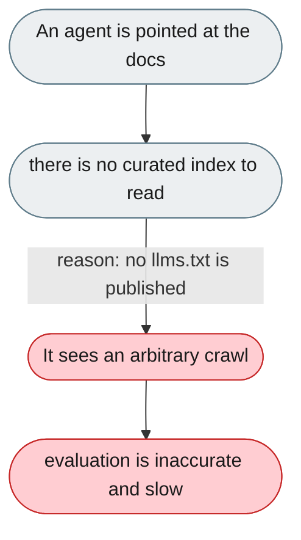
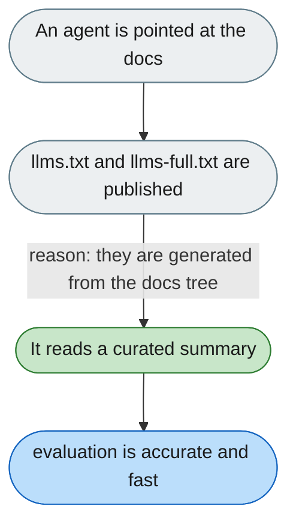

---

# Docs are invisible to agents evaluating us (no llms.txt)

*Concern: Documentation & Stability*

---

## The problem today

There is no `llms.txt`/`llms-full.txt` index, so an agent pointed at the docs only gets whatever the crawler happens to find instead of a curated, self-updating summary.

---

## The proposed fix

Publish generated `llms.txt` (curated index) and `llms-full.txt` (full concatenated docs), built from the docs tree in CI so they stay current whenever pages change.

