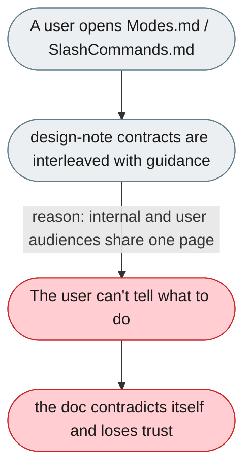
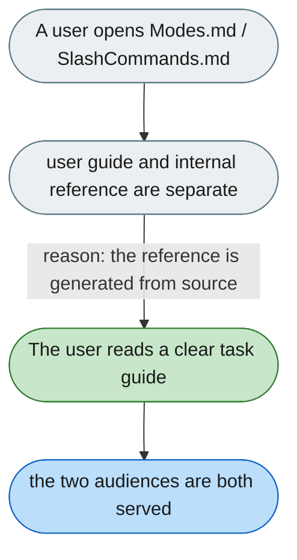

---

# User docs are written like internal design notes

*Concern: Documentation & Stability*

---

## The problem today

User-facing docs (`Modes.md`, `SlashCommands.md`) mix canonical matrices, `deprecate_mode` and string-literal contracts with user guidance, and even contradict themselves. Internal and user audiences are both served badly.

---

## The proposed fix

Split each page into a user-facing, task-oriented guide (what to do, with examples) and a separate internal reference (canonical matrices, contracts, deprecation). Generate the reference from source so the two cannot contradict.

