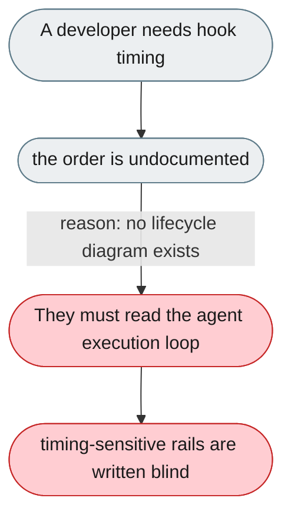
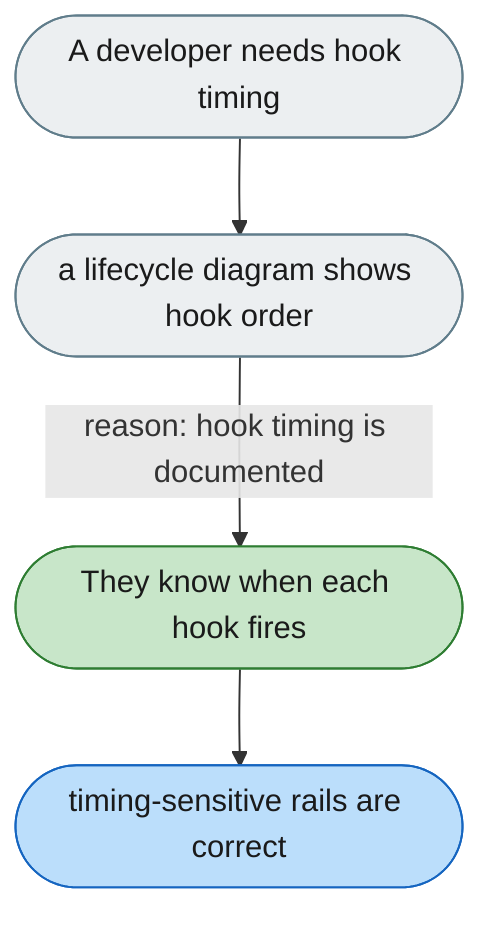

---

# Rail hook execution order can only be learned from source

*Concern: Rails & Context API*

---

## The problem today

Whether `before_model_call` fires before the prompt is assembled, or where `after_tool_call` lands relative to history, is undocumented — and rail `priority` ordering isn't stated beyond "higher runs first".

---

## The proposed fix

A lifecycle diagram showing the agent loop with each hook point, and an explicit statement of priority ordering.

