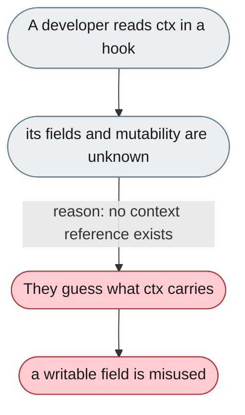
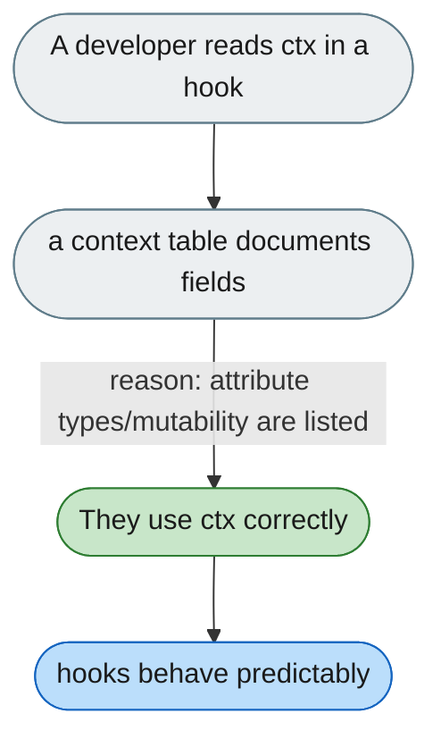

---

# The hook context object is undocumented and untyped

*Concern: Rails & Context API*

---

## The problem today

Every hook gets `ctx: AgentCallbackContext`, but what's on it (and which fields are mutable) is only discoverable by reading the dataclass — e.g. does `ctx.messages` reflect the assembled prompt or raw history?

---

## The proposed fix

A context reference table: each attribute's type, whether it's mutable, and which hooks it's populated in.

