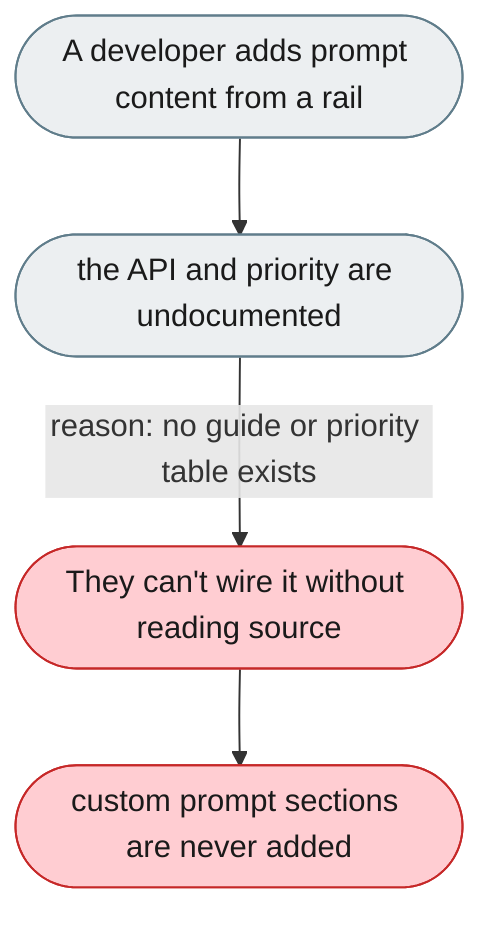
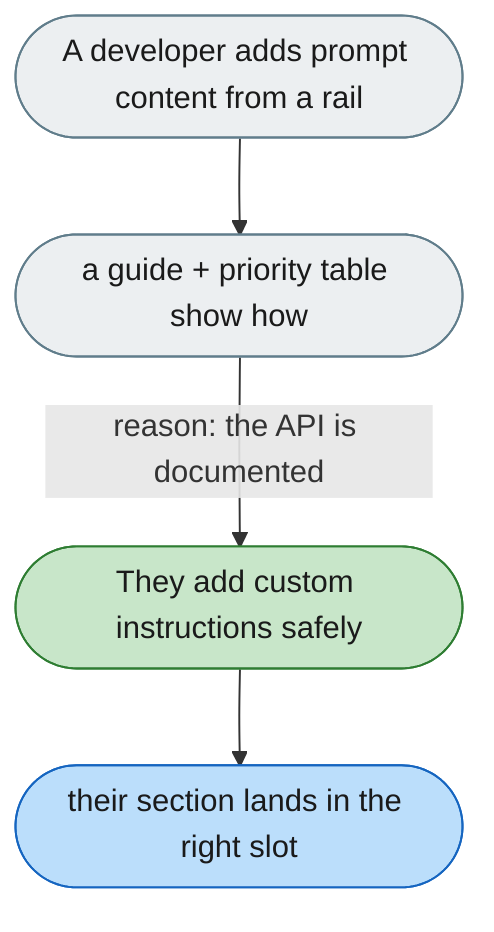

---

# Adding prompt content from a rail is an undocumented hidden API

*Concern: Rails & Context API*

---

## The problem today

Adding custom instructions to the system prompt from a rail (`system_prompt_builder.add_section(...)`) is the most common extension use case, but the API and priority model are documented nowhere.

---

## The proposed fix

An "Adding prompt content from a rail" guide with a working example, plus a table of reserved priority ranges so custom sections don't collide with built-ins.

