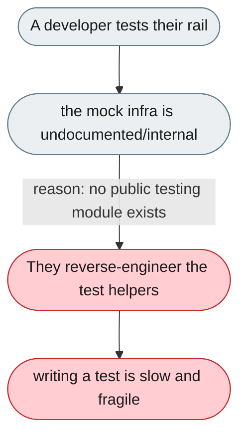
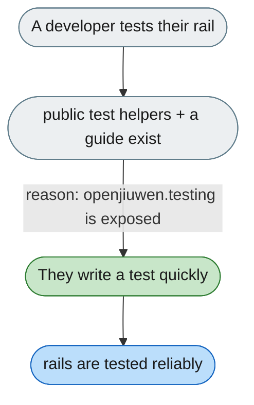

---

# Writing a rail test requires reverse-engineering mock infrastructure

*Concern: Extension Testing & Tooling*

---

## The problem today

The mock test infra (`MockLLMModel`) is excellent but undocumented and internal; `_make_agent()` is a private helper, so writing a rail test means reading test source.

---

## The proposed fix

A public `openjiuwen.testing` module (`make_test_agent`, `MockLLMModel`, ...) and a "Testing your rail" guide so a test fits in under 20 lines.

