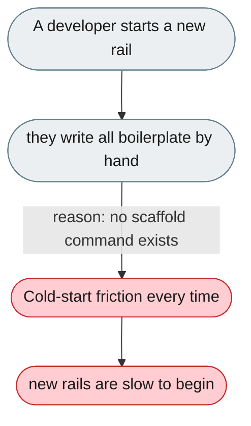
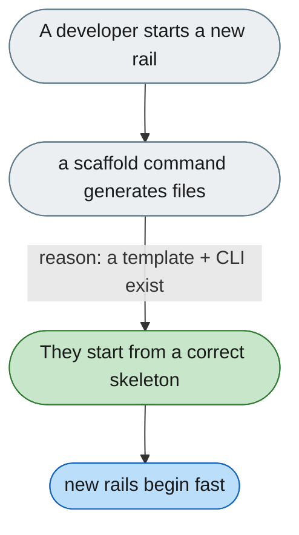

---

# No CLI to scaffold a new rail or skill

*Concern: Extension Testing & Tooling*

---

## The problem today

Creating a rail means writing boilerplate by hand — no `openjiuwen new rail`, no template, no example to copy.

---

## The proposed fix

An `openjiuwen new rail` command that generates a rail file and a working test from a template.

