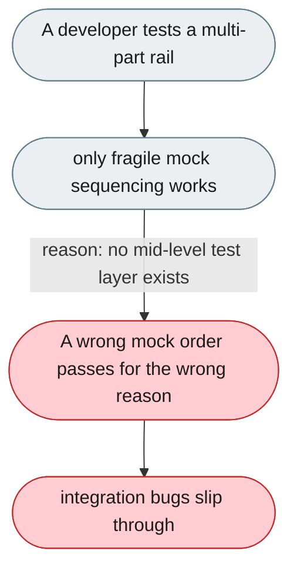
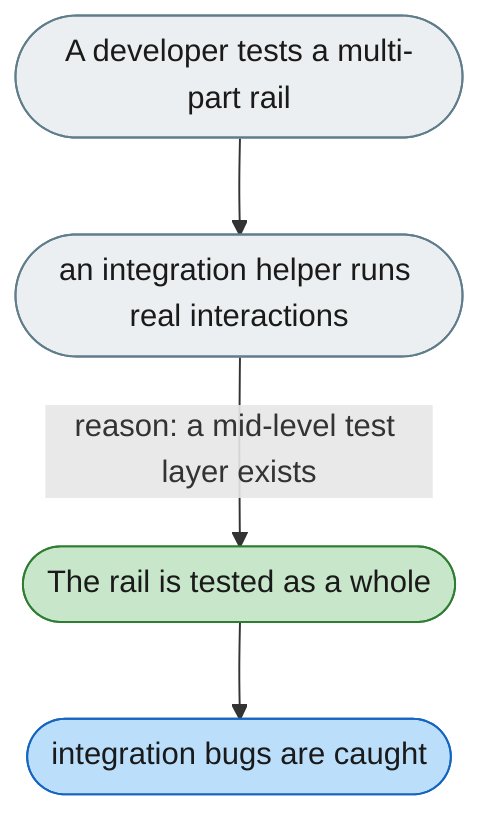

---

# No integration test layer between unit tests and a full system

*Concern: Extension Testing & Tooling*

---

## The problem today

There's unit tests (mocked) and full end-to-end, but nothing in between — testing a rail that touches prompt builder, tools, and results requires fragile mock-response sequencing.

---

## The proposed fix

A higher-level integration helper (e.g. `run_agent_with_rail`) that hides mock sequencing and runs the real interactions.

