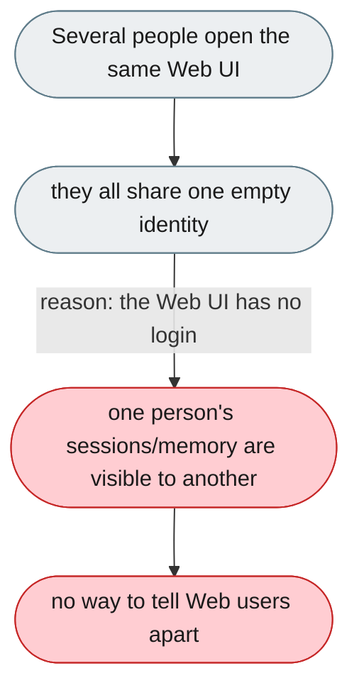
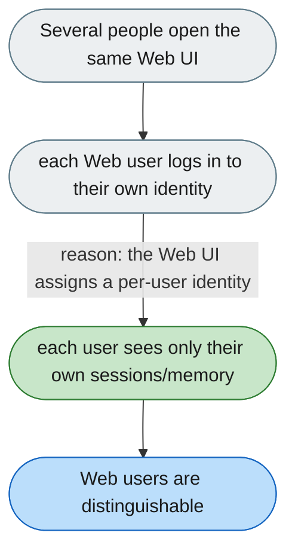

---

# No login on the Web UI: local Web users share one identity

*Concern: Identity & Isolation*

---

## The problem today

The Web UI has no login, so everyone who opens a given instance shares one **empty** identity — the same sessions, memory, and channel-less context. This affects the Web surface only: channel users (Feishu/Telegram/WeChat) already carry a distinct `user_id` that the server scopes by. The gap is that the Web UI gives a person no identity at all, so it only becomes a problem when more than one person uses the same Web instance.

---

## The proposed fix

Give the Web UI a per-user identity (login), so each person on a shared Web instance is a distinct user with their own sessions and memory. For a personal local instance (one user) no login is fine; the fix matters only when several people use the same Web UI.

Scoping the `user_id` that channel/API requests already carry is a separate, broader problem — see [No multi-tenancy: every user shares one workspace](2-no-multi-tenancy-every-user-shares-one-workspace.md).
