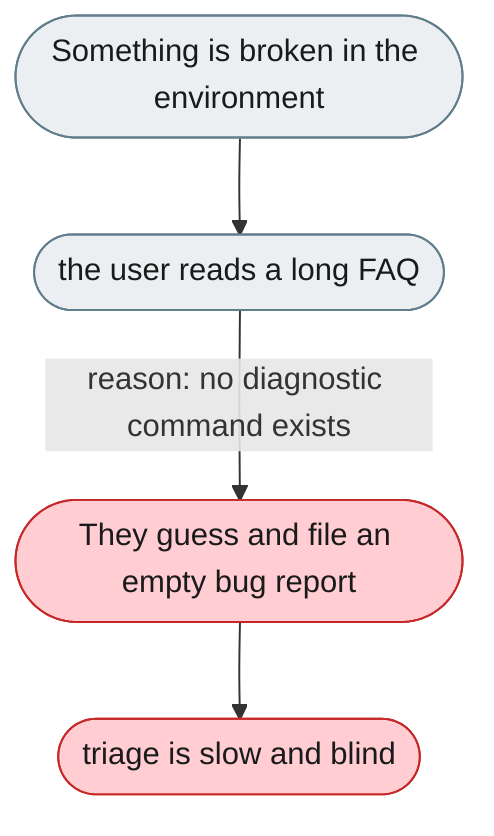

---

# No diagnostic ('doctor') command

*Concern: Diagnostics*

---

## The problem today

Environment failures route to a long prose FAQ, and bug reports arrive with no baseline. There is no single pass/fail diagnostic that prints the fix inline.



---

## The proposed fix

Add a `jiuwenswarm doctor` command that checks Python version, installed extras, config validity, model connectivity, ports and permission state, prints pass/fail per check with the fix inline, and can emit a redacted bundle for a bug report.

```mermaid
flowchart TD
    classDef fail  fill:#FFCDD2,color:#1a1a1a,stroke:#C62828
    classDef ok    fill:#BBDEFB,color:#1a1a1a,stroke:#1565C0
    classDef fix   fill:#C8E6C9,color:#1a1a1a,stroke:#2E7D32
    classDef plain fill:#ECEFF1,color:#1a1a1a,stroke:#607D8B
    START(["Something is broken in the environment"]):::plain
    MID(["`jiuwenswarm doctor` runs pass/fail checks"]):::plain
    START --> MID
    MID -->|"reason: each failing check prints its fix"| OUT(["The user fixes it or attaches the bundle"]):::fix
    OUT --> DONE(["triage starts from a baseline"]):::ok
```
