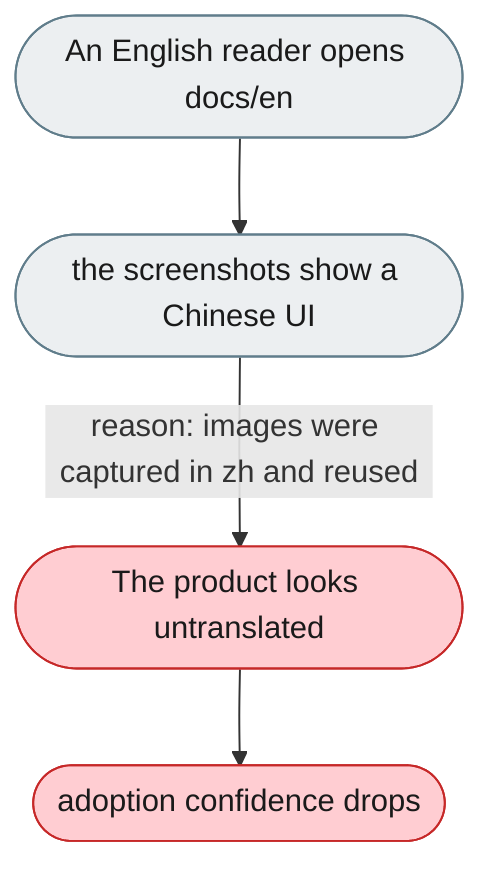
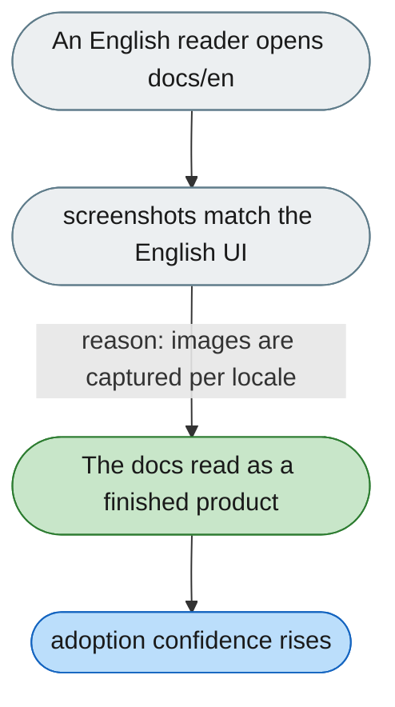

---

# English docs show the Chinese UI

*Concern: Documentation*

---

## The problem today

55 of 144 image references in `docs/en` point at screenshots of the Chinese interface — on exactly the pages a reader views before deciding to adopt.

---

## The proposed fix

Regenerate the English screenshots from an English instance, and add a docs check that fails when a `docs/en` image was produced under a non-English locale. Where a feature has no English UI yet, say so in text instead of showing the Chinese screen.

