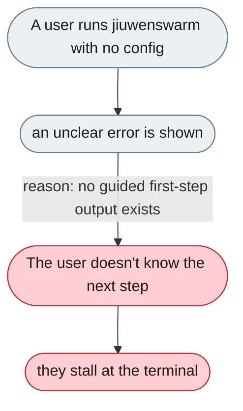
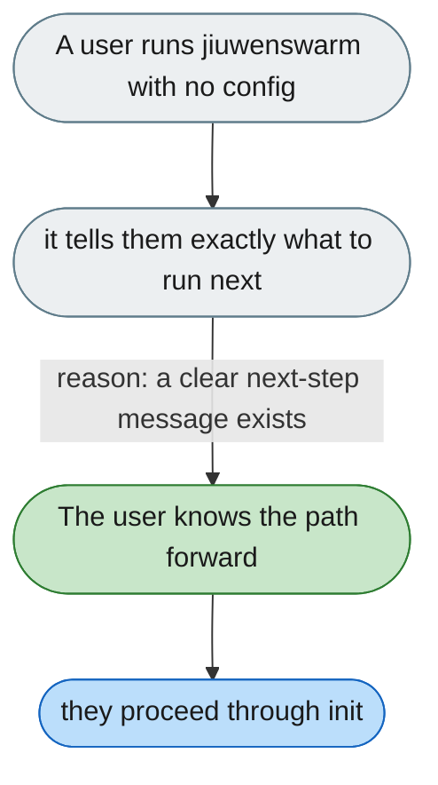

---

# Running the CLI without config gives no next step

*Concern: First Run*

---

## The problem today

Running `jiuwenswarm` from the terminal with no config gives an unclear error, and `--help` doesn't walk through what to do first.

---

## The proposed fix

Tell the user plainly: "No config found — run `jiuwenswarm-init`, then `jiuwenswarm-start`", and have `jiuwenswarm-init` prompt for the minimum required config (provider, API key) before exiting.

