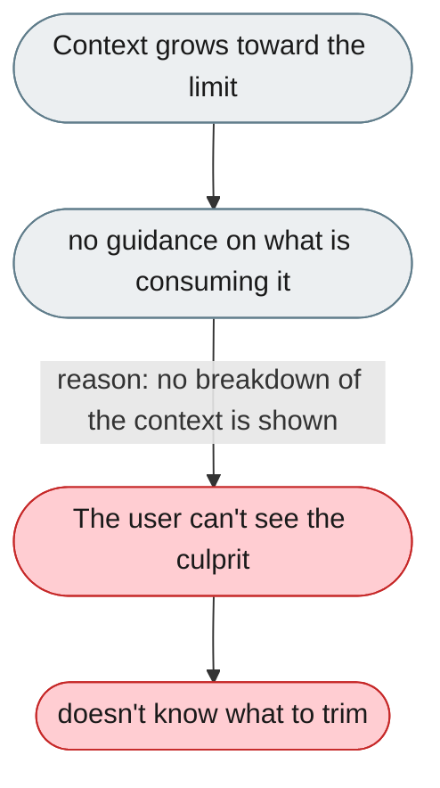
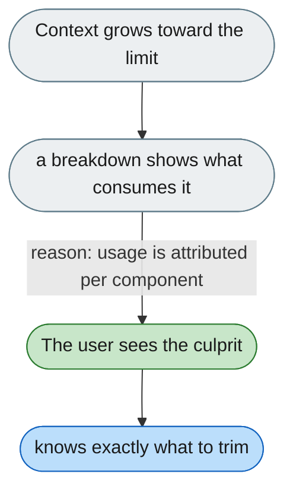

---

# No hints about what is consuming the context

*Concern: Cost & Token Economics*

---

## The problem today

When a session's context grows large there's no guidance on how to shrink it — the user can't tell whether the cause is memory, skills, or history.

---

## The proposed fix

Past ~70% tokens, show a breakdown — "history 40%, memory 35%, skills 15%, system 10%" — each linking to the fix: "Reduce memory snapshot size", "Use auto_list mode for skills".

