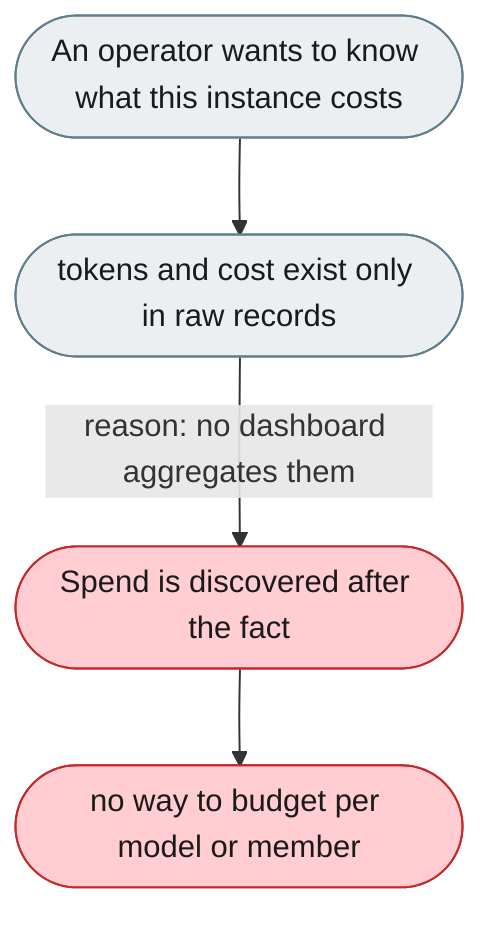
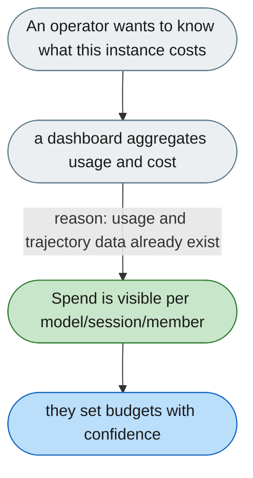

---

# No per-model budget dashboard

*Concern: Cost & Tokens*

---

## The problem today

There is no token/cost dashboard broken down per model, session or team member, and no activity heatmap or error/latency sparklines. Spend is only visible by reading logs or usage records directly.

---

## The proposed fix

Build the dashboard on data already recorded: the session usage/cost accumulator and the trajectory store. Show tokens and cost per model, session and member, plus an activity heatmap and error/latency sparklines.

