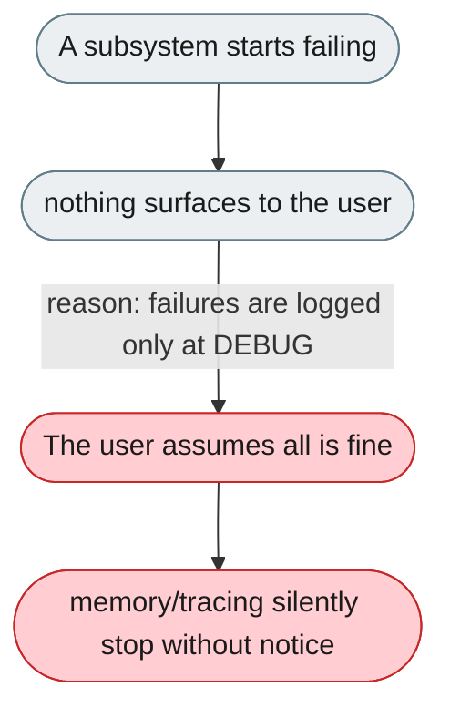
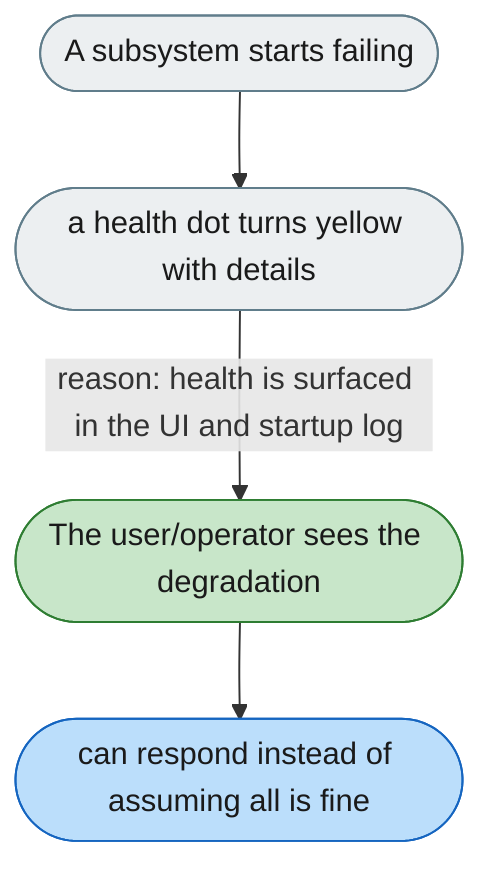

---

# You aren't told when a subsystem fails

*Concern: Health & Degradation*

---

## The problem today

When a non-critical subsystem fails — memory provider down, OTel exporter unreachable, a channel fails to init — the system keeps running but the user gets no notice and assumes memory is being saved when it isn't. `config.py:84` logs this at DEBUG.

---

## The proposed fix

A persistent health indicator in the Web UI (a small dot in the sidebar/bottom bar): green = all nominal, yellow = a subsystem degraded (click for details), red = agent unreachable. Hover/click shows "Memory: degraded (disk full). OTel: offline." The same state should be printed to the startup log stream so log-monitored deployments see it. Related: [startup validation](../startup-and-config/1-wrong-credentials-surface-only-on-the-first-chat-never-at-startup.md).

