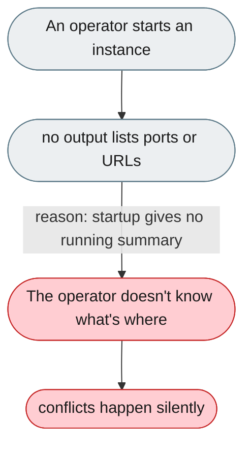
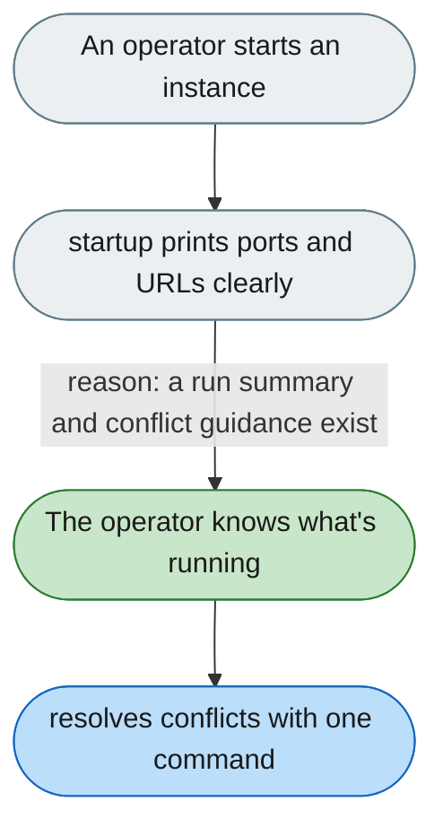

---

# No visibility into which ports and URLs are in use

*Concern: Running & Managing the Instance*

---

## The problem today

After `jiuwenswarm-start --name alice` there is no output telling you which ports were assigned, which URL to open, or what is running; port conflicts fall back silently.

---

## The proposed fix

Print a clear startup summary (agent server / gateway / web UI URLs), and on a port conflict show the offending PID and the exact command to stop it or use another base port.

