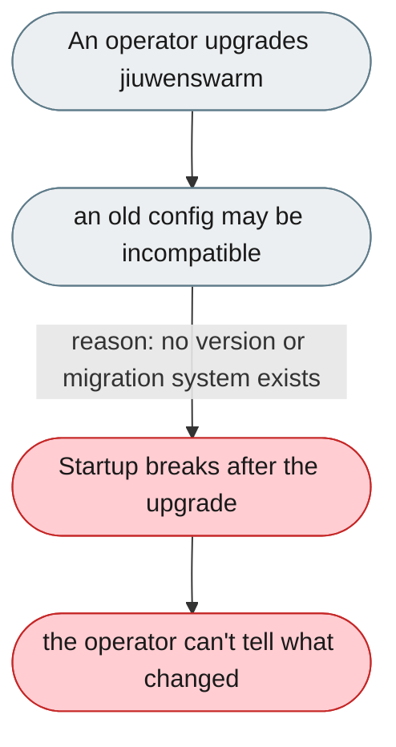
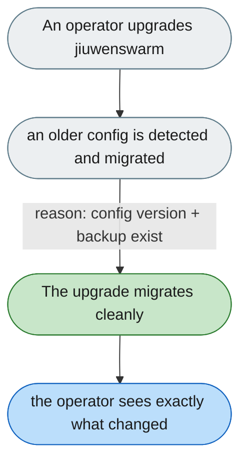

---

# Upgrading can silently break an existing config

*Concern: Running & Managing the Instance*

---

## The problem today

`pip install --upgrade jiuwenswarm` has no config version, no migration, and no breaking-change changelog — an old config may silently break after upgrade.

---

## The proposed fix

A `jiuwenswarm_config_version`; on startup, if the config is older, print a migration guide or auto-migrate with a backup; and a changelog section for config-breaking changes.

