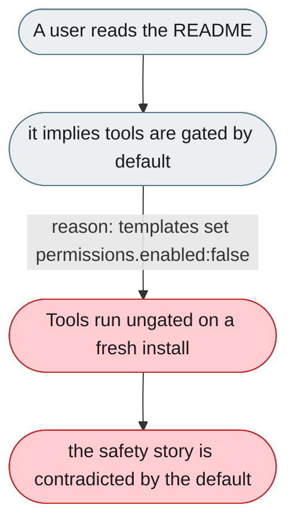
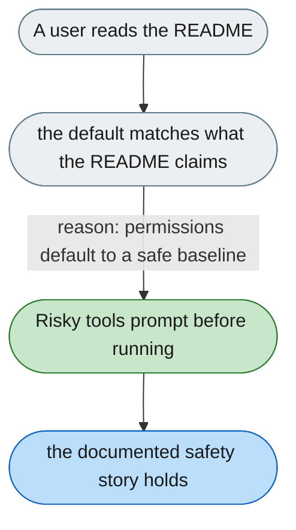

---

# Default permissions are off, contradicting the README

*Concern: Running & Managing the Instance*

---

## The problem today

All shipped config templates set `permissions.enabled: false`, so a user who reads the README believes tools are gated when they are not. Tiered policy and Smart Approval are dark on a fresh install.

---

## The proposed fix

Either enable permissions by default with a safe baseline (ASK for risky actions, ALLOW for reads), or state the disabled default explicitly in the README and warn on first run. Tiered policy and Smart Approval should be visible, not dark.

