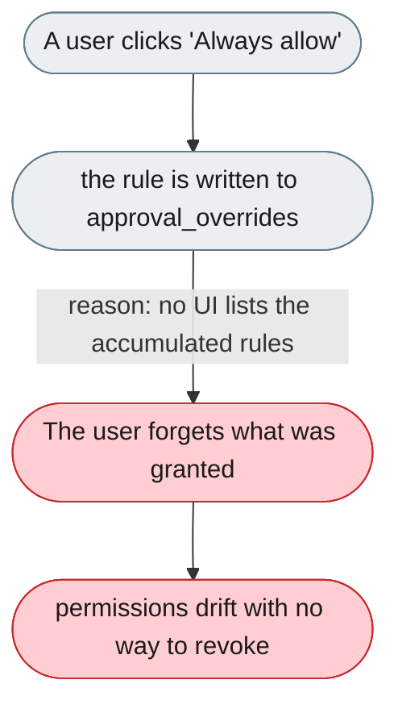
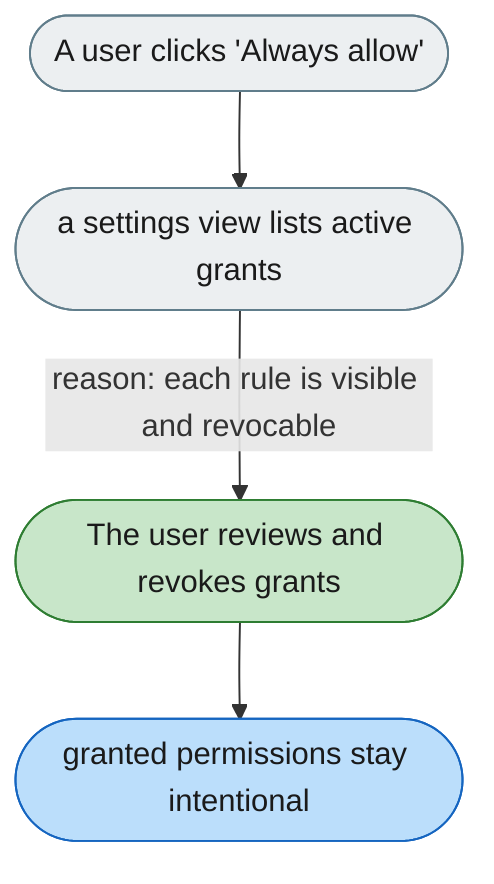

---

# Granted permissions are invisible once granted

*Concern: Running & Managing the Instance*

---

## The problem today

"Always allow" choices write into `approval_overrides`, but there is no in-UI view of what has accumulated. A user cannot see or revoke what they have allowed.

---

## The proposed fix

Add a "Granted permissions" settings view that lists every active `approval_overrides` rule with its scope and a one-click revoke, plus an audit line showing when and from which prompt each was granted.

