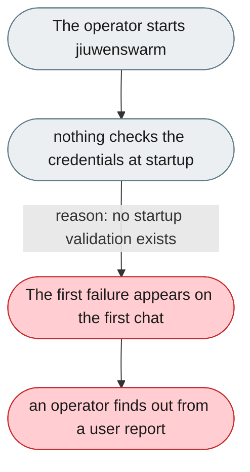
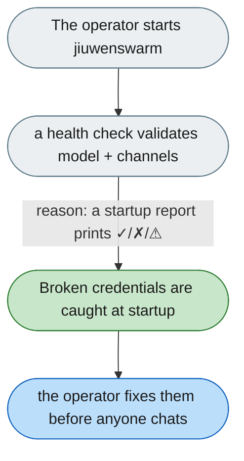

---

# Wrong credentials surface only on the first chat, never at startup

*Concern: Startup & Configuration*

---

## The problem today

Model credentials and channel tokens are never validated at startup. `jiuwenswarm-init` completes, the web UI loads, and the first failure only appears on the first chat message; a wrong `app_secret`/`bot_token` fails silently.

---

## The proposed fix

A startup health check before the first request: validate model config (test request, HTTP 200), each enabled channel (token format/test call), workspace permissions, and optional deps. Print a health report to stdout.

