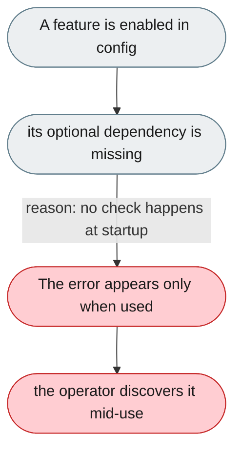
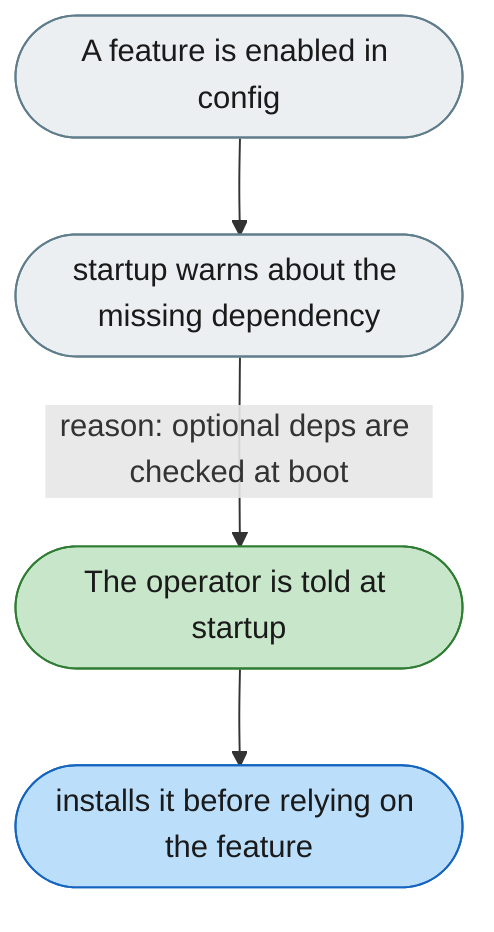

---

# Missing optional extras fail when used, not at startup

*Concern: Startup & Configuration*

---

## The problem today

SSH needs `jiuwenswarm[ssh]`; TUI needs `jiuwenswarm-tui`. Neither is checked at startup, so the error appears only when the operator enables the feature.

---

## The proposed fix

`jiuwenswarm-start` checks all optional dependencies referenced in config and warns at startup with the install command and that the feature is disabled until installed.

