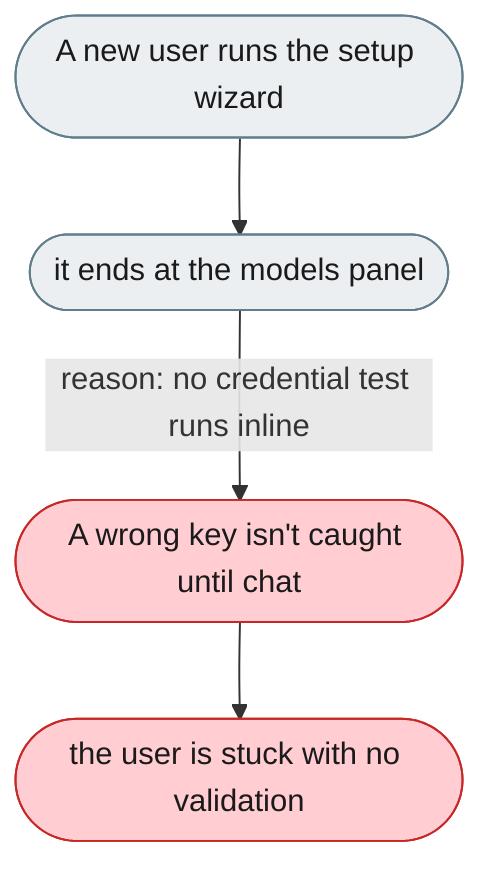
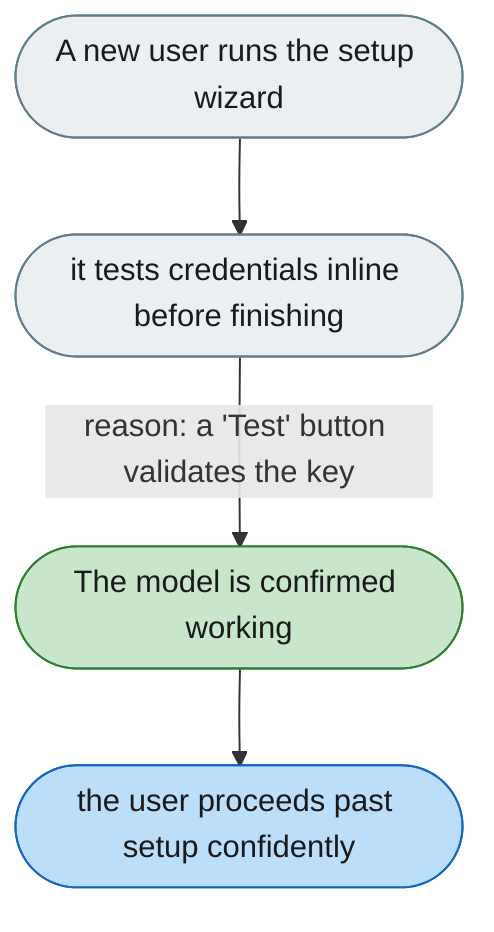

---

# Setup ends before credentials are tested

*Concern: Startup & Configuration*

---

## The problem today

`ModelSetupGuide.tsx` runs a 3-step spotlight tour that ends at the models panel. The user must fill in API key/base/model themselves; a wrong value isn't caught until the first chat.

---

## The proposed fix

The wizard should not finish until the model works: choose a provider, enter the API key, press "Test" for a live ✓/✗, optionally set up a channel the same way, then "Start your first conversation". Re-enterable from a `?` icon.

