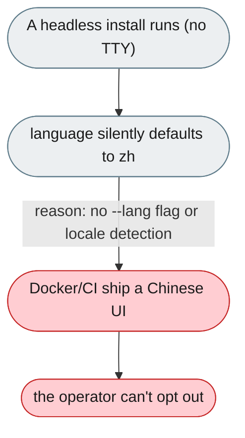
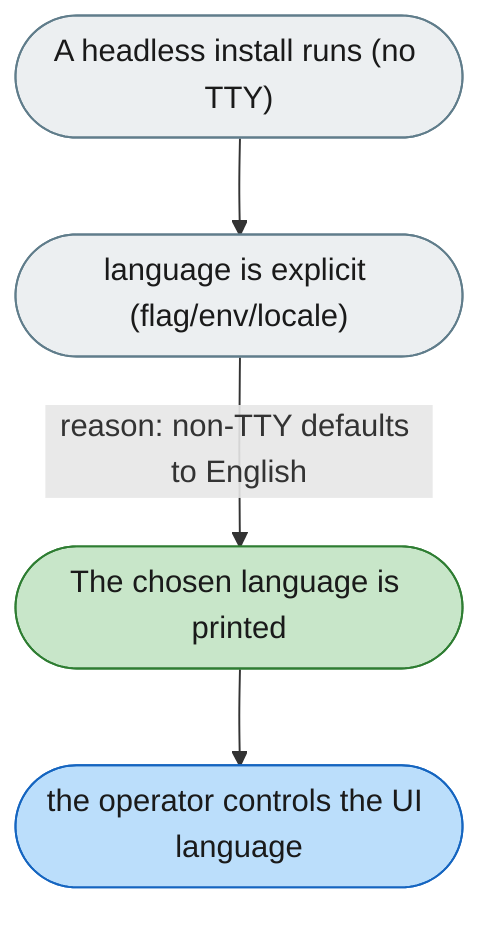

---

# Headless installs silently become Chinese installs

*Concern: Startup & Configuration*

---

## The problem today

When stdin is not a TTY, the prompt language defaults to `zh` and only a log line records it. Docker, CI and provisioning therefore silently produce a Chinese UI, with no flag to avoid it.

---

## The proposed fix

If stdin is not a TTY, default to English (or to the system locale), and add a `--lang` flag plus a `JIUWEN_LANG` env var. Print the chosen language explicitly so headless logs make it obvious.

