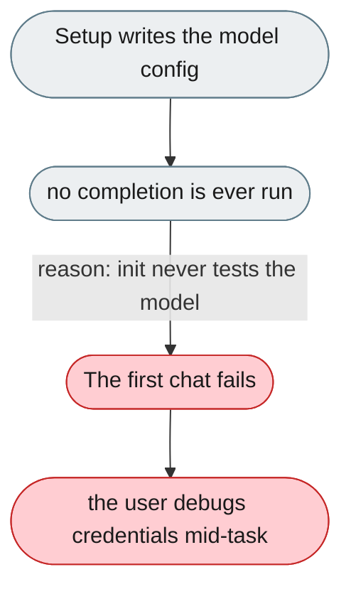
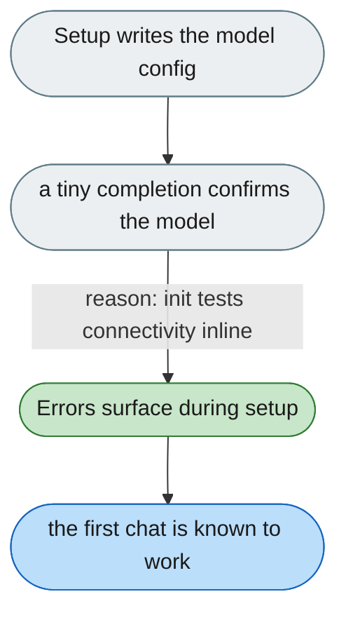

---

# Nothing verifies the model before the first conversation

*Concern: Startup & Configuration*

---

## The problem today

Setup never gates on a real model completion, and `jiuwenswarm-init` never touches model config at all. Model-config errors are therefore pushed into first use instead of being caught at write time.

---

## The proposed fix

Add a verification step to setup/init that runs a single tiny completion against the configured model and blocks with an actionable error (bad key, bad base URL, unreachable endpoint) before declaring setup complete.

