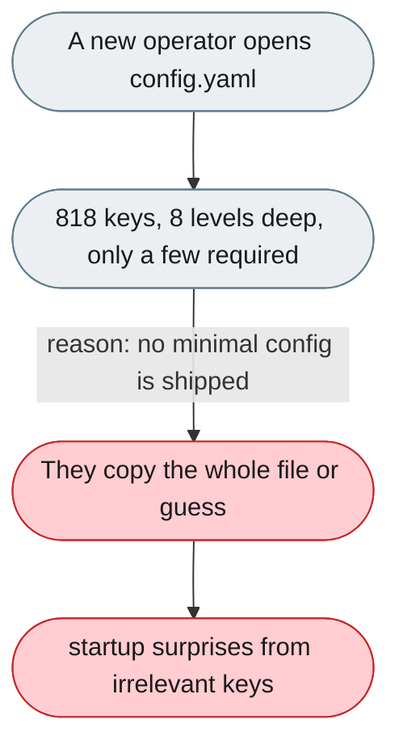
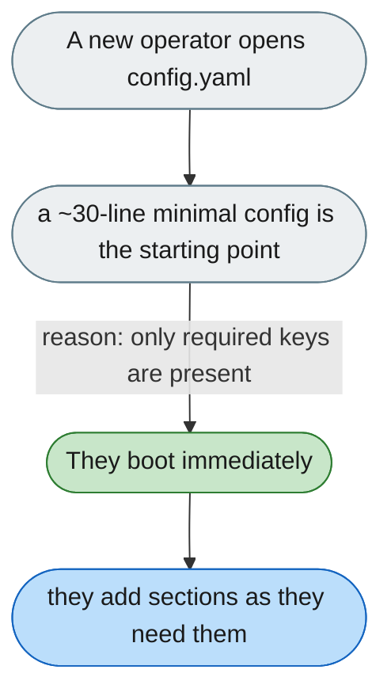

---

# No minimal starting point for config (818 keys)

*Concern: Startup & Configuration*

---

## The problem today

The shipped `config.yaml` is 1,510 lines, 818 keys, eight levels deep, with mixed-language comments. Only a handful of keys matter on day one, but there is no ~30-line minimal config, so a newcomer either copies the whole file or guesses which keys are required.

---

## The proposed fix

Ship a `config.minimal.yaml` (~30 lines) that boots a working agent and carries a comment per required key; keep the full file as the reference. Point the README and `jiuwenswarm init` at the minimal file first, and grow it by copying sections on demand.

