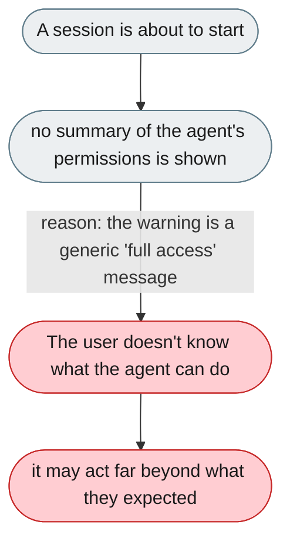
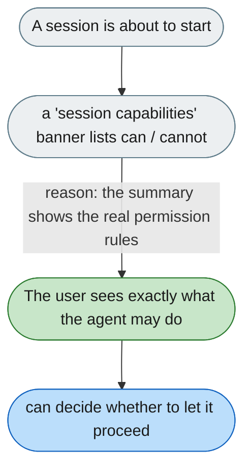

---

# Users aren't told what the agent is allowed to do before it acts

*Concern: Permissions*

---

## The problem today

The agent can run bash, read/write files, send Feishu messages, call web APIs, and spawn subagents. Before a session starts, the user sees no summary of current permissions. `PermissionWarningDialog` only shows a generic "full access warning" — it never lists what is specifically permitted.



---

## The proposed fix

A "Session capabilities" summary as a collapsible banner at the top of a new conversation:

```
This agent can: read/write files in /home/mishka/invoices/ · send Feishu messages
                · run bash commands · call the parse-invoice skill
This agent cannot: access the internet · modify files outside the project directory
```

Click any item to see the permission rule behind it, and toggle tool access for this session without editing config.


