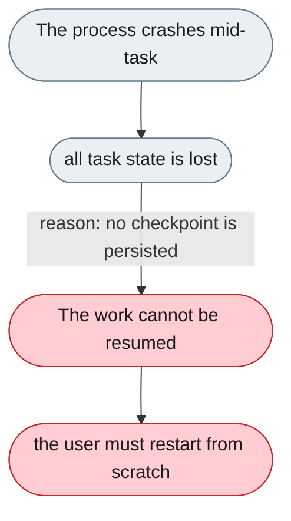
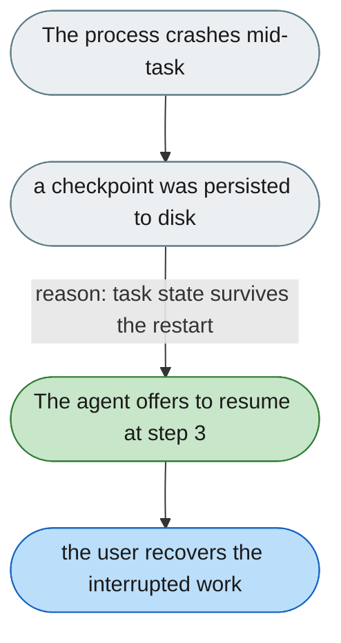

---

# A crash loses in-progress tasks with no way to resume

*Concern: Stop, Resume & Undo*

---

## The problem today

If the process crashes mid-task, the task is lost — there is no checkpoint, so the agent can't resume from step 3 of 5 after a restart.

---

## The proposed fix

Persist the todo state (`TaskPlanningRail`) to disk as a per-session JSON so the agent can offer "last session was interrupted at step 3: parse invoices. Resume?" after a restart. The checkpoint store should be configurable (local disk or a durable store) to survive restarts in containerized/multi-user deployments.

