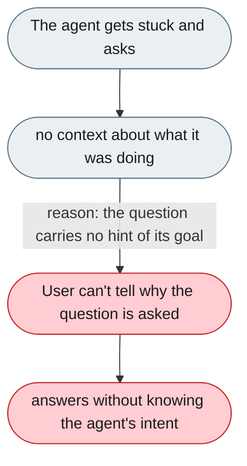
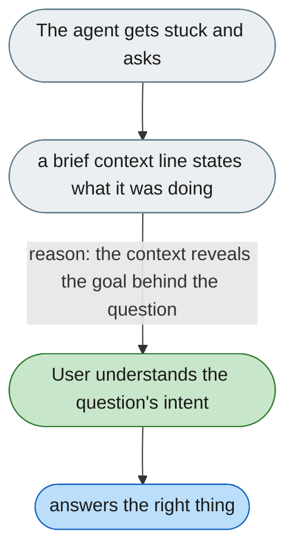

---

# Clarification questions appear with no context

*Concern: Agent Explanation*

---

## The problem today

When the agent asks for clarification ("Which directory should I write the output to?"), there is no hint of what it was doing when it got stuck, so the user must infer from context.

---

## The proposed fix

Attach a brief context line to every clarification request:

> "I'm about to write the output CSV and wasn't sure of the destination."
> **Which directory should I write the output file to?**

