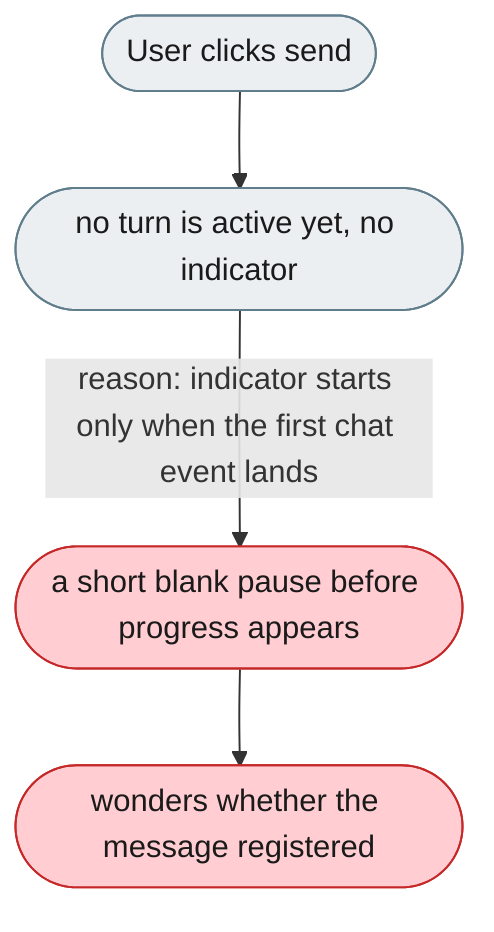
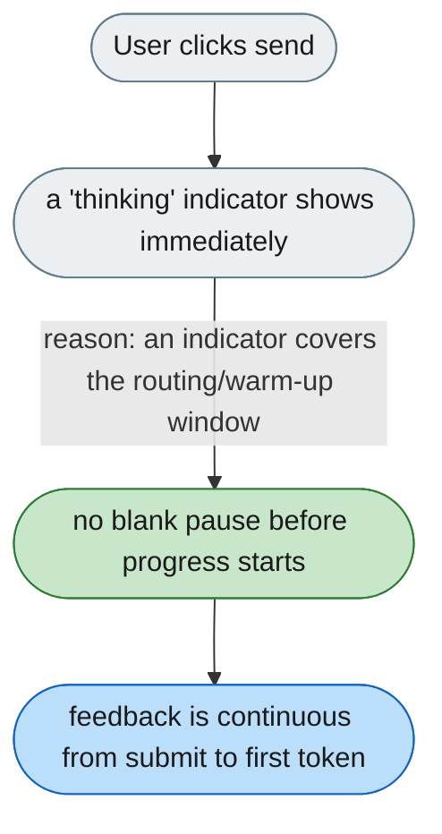

---

# No immediate feedback between submit and the first chat event

*Concern: Output & Perceived Speed*

---

## The problem today

Once a turn is active, the UI shows live progress (a running timer/spinner, streaming reasoning, and tool activity). But in the brief window between clicking **send** and the first `chat.reasoning` / `chat.processing_status` event — routing, context assembly, model warm-up — no turn is active yet, so there is no indicator: the last message simply sits there for a moment.

Once the first `chat.reasoning` / `chat.processing_status` event arrives, the active-turn indicators (running timer/spinner, reasoning, tool progress) cover the rest of the response.

---

## The proposed fix

Show an animated "thinking" indicator (three dots / pulsing bar) the moment the message is submitted, and clear it when the first chat event (reasoning or token) arrives. The existing per-turn running spinner already covers everything after that point.

