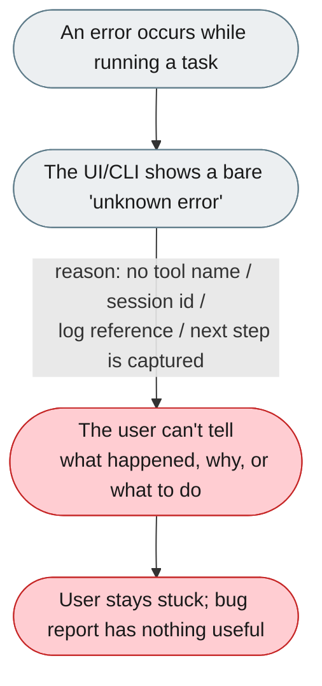
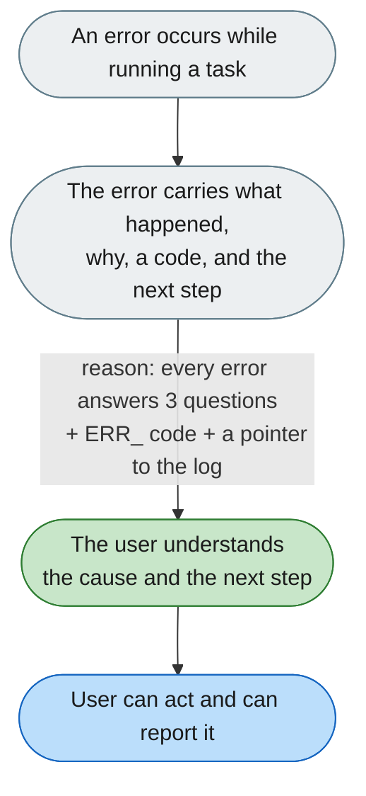

---

# Error messages give no explanation or next step

*Concern: Errors & Feedback*

---

## The problem today

When an error occurs, jiuwenswarm shows a bare message that gives the user nothing to act on. Two examples reached production:

```python
# channels/cli/render.py:200
error = payload.get("error") or payload.get("message", "unknown error")
```
When neither field is present, the user sees `unknown error` — no tool name, no session id, no log reference, no next step. The same pattern repeats elsewhere: failures surface without saying whether the cause was a network issue, a protocol mismatch, or a bug, so the user cannot tell what went wrong or what to do about it.



---

## The proposed fix

Every error surfaced to the user should answer three questions: what happened, why it happened, and what to do next.

> "The parse-invoice skill failed to read /data/invoices/inv_003.pdf — the file may be corrupted or password-protected. Try opening the file manually to verify it."

> "Lost connection to the gateway (WebSocket closed). The agent has stopped. Your conversation is saved. Reload the page to reconnect."

The CLI and Web UI should agree on the error format, and errors should carry a short machine-readable code (e.g. `ERR_GATEWAY_DISCONNECT`) so a user can search for it in docs or paste it into a support request.



Related: [Errors don't point to the log entry with more detail](../../setup-and-operation/diagnostics-and-help/2-errors-dont-point-to-the-log-entry-with-more-detail.md).
