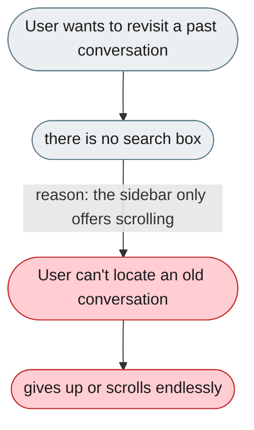
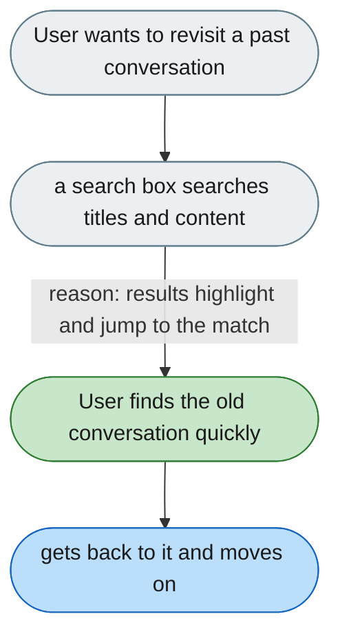

---

# Past conversations can't be searched

*Concern: Messages, History & Notifications*

---

## The problem today

`ConversationSidebar.tsx` shows sessions grouped by project with rename, delete, and pin — but no search. Finding a specific past conversation means scrolling through every session.

---

## The proposed fix

A search box at the top of the conversation sidebar that searches across session titles and message content. Results highlight the matching message and jump to it — table-stakes for any chat product.

