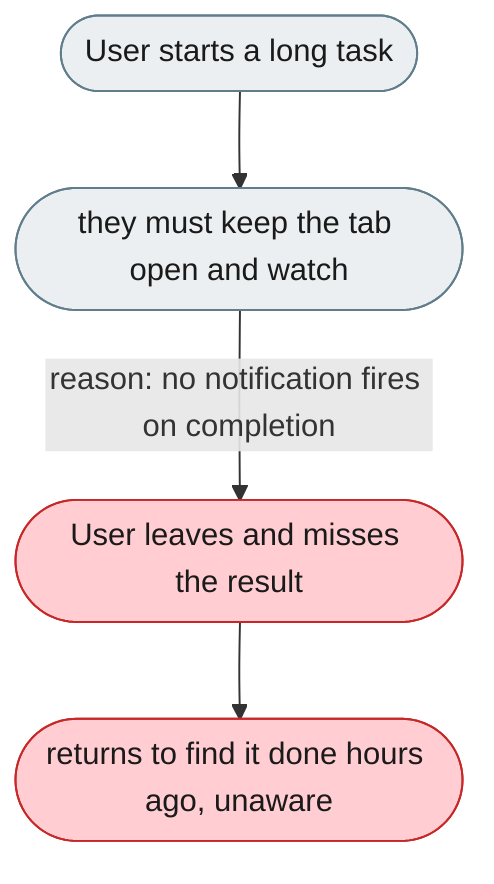
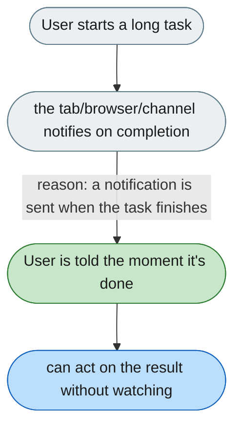

---

# No notification when a long task finishes

*Concern: Messages, History & Notifications*

---

## The problem today

For tasks that take minutes, the user must keep the Web UI open and watch. There is no desktop notification, sound, badge, or message-to-self when the task completes — only in-app toasts.

---

## The proposed fix

- **Browser notification:** on task complete, fire a Web Notifications API notification: "Invoice parsing complete — 3 files processed."
- **Sound:** an optional, user-configurable completion sound.
- **Tab badge:** set the page title to show unread results: "(✓) jiuwenswarm".
- **Channel self-message:** option to send the result summary to the user's own Feishu/Telegram account.

