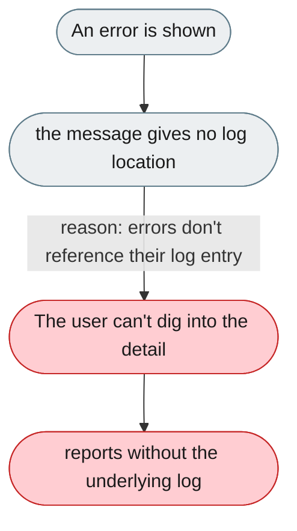
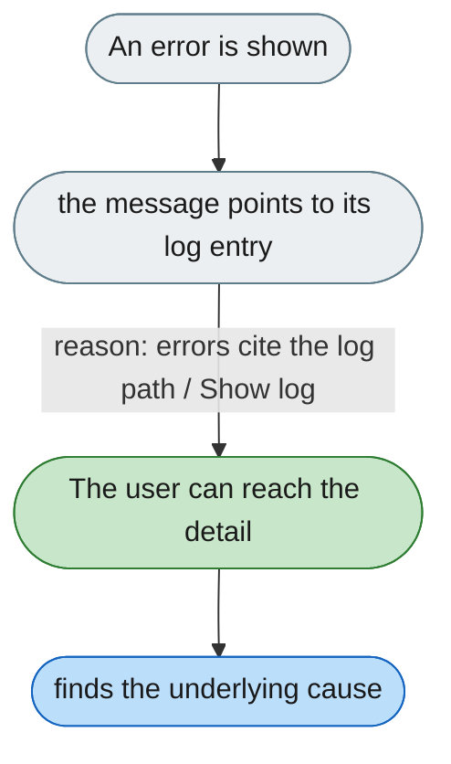

---

# Errors don't point to the log entry with more detail

*Concern: Diagnostics & Support*

---

## The problem today

When an error occurs the user isn't told where to look for more detail — they must know logs exist, where they are, and how to read them.

---

## The proposed fix

Every error with more detail should end with "Full details in ~/.jiuwenswarm/agent/.logs/agent_server.log", or offer a "Show log" button (last 60s of the session). stderr errors should include the log path automatically. Related: [Error messages give no explanation or next step](1-error-messages-give-no-explanation-or-next-step.md).

