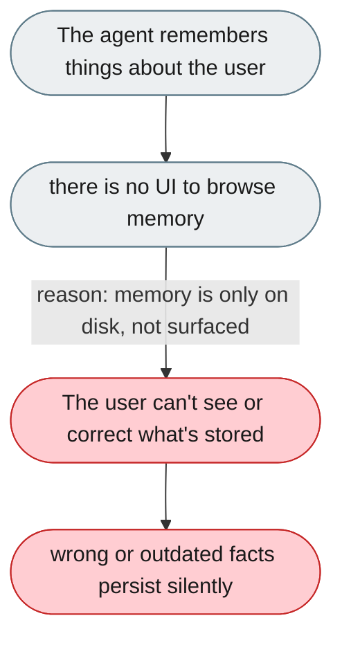
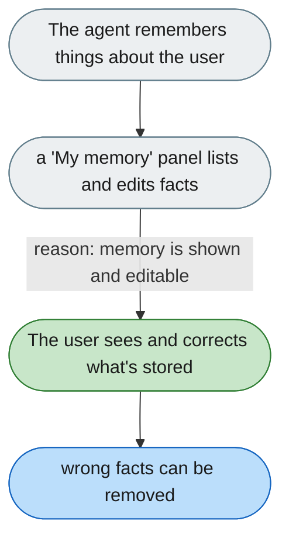

---

# Users can't see what the agent has remembered

*Concern: Memory Visibility*

---

## The problem today

The memory system stores facts, daily logs, and profile data in `~/.jiuwenswarm/workspace/`. Users have no UI to browse, search, edit, or delete what the agent has remembered about them.

---

## The proposed fix

A "My memory" panel (from the sidebar) showing: `USER.md` as a profile card, `MEMORY.md` as a searchable fact list, recent daily entries, a "Delete fact" button on each item, and a confirmed "Clear all memory" action.

