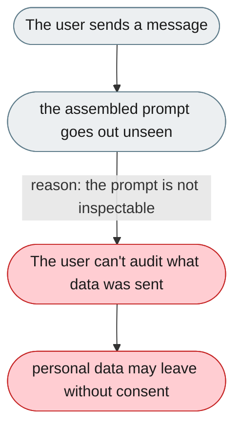
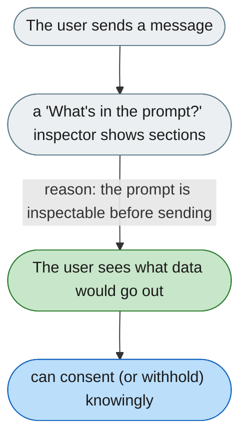

---

# No way to see what personal data is sent to the model

*Concern: Memory Visibility*

---

## The problem today

The full prompt sent to the model — memory snapshot, skills, history, system sections — is invisible. The user cannot audit what personal data is sent to an external API.

---

## The proposed fix

A "What's in the prompt?" inspector (ⓘ on the model indicator) summarising the current prompt: token count, which sections are included, and whether memory/skills are attached — so the user sees that their `USER.md` is included before consenting to an external model.

