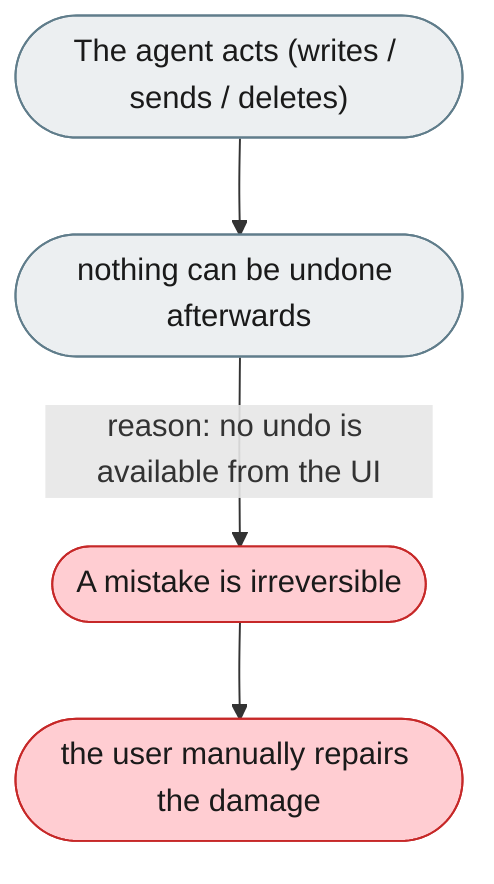
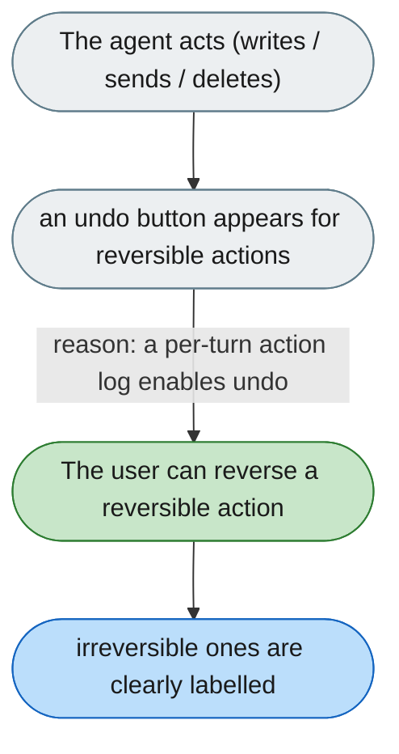

---

# Sent messages and API calls can't be undone

*Concern: Stop, Resume & Undo*

---

## The problem today

The agent can send Feishu messages, call external APIs, and fire webhooks — none of these can be undone from the UI; once sent, they are sent. File edits are a partial exception: applied **code-mode** changes appear as per-turn change cards that can be *discarded* (reverted) or re-applied, but there is no general "undo last action" that spans all agent actions, and non-code file writes and external sends have no reversal path.

---

## The proposed fix

A post-action summary card after each turn. For reversible actions (file writes, deletes), an "Undo last action" button for ~30s. For irreversible actions (messages sent, API calls), a clear label "This action cannot be undone." Requires the harness to track a per-turn action log — feasible given the trajectory system.

