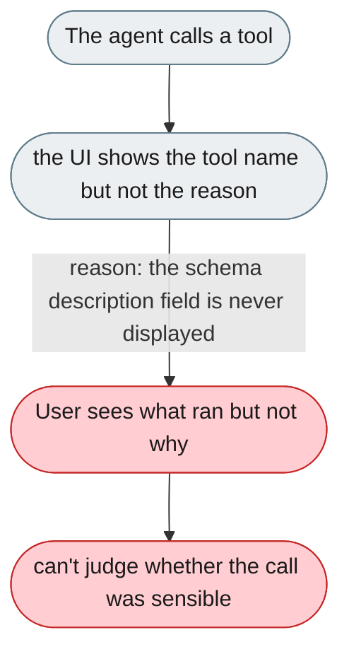
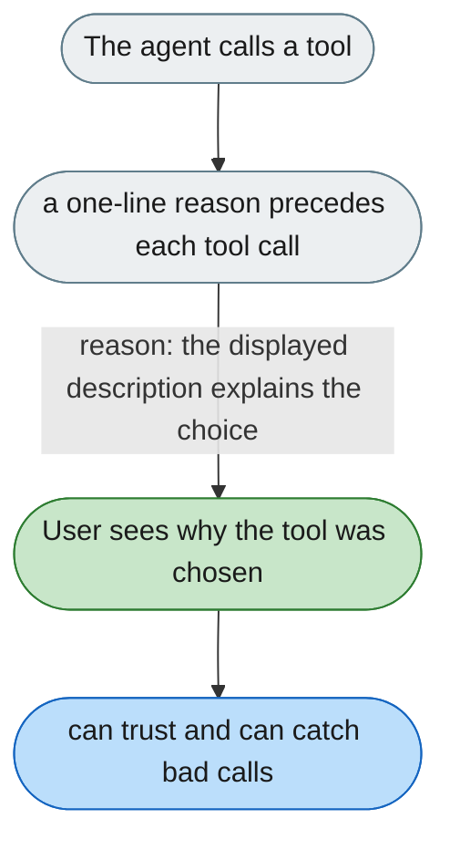

---

# Tool calls show what ran but not why

*Concern: Agent Explanation*

---

## The problem today

`ToolCallDisplay.tsx` shows the tool name, arguments (expandable), success/failure, and a short description when one is set. What it does not show is the *reason* the agent chose this tool. So the user sees `read_file("/data/invoices/inv_001.pdf")` (and its description) but not why the agent read it.



---

## The proposed fix

Show a one-sentence rationale before each tool call, from the agent's reasoning or synthesized from the thinking trace:

```
Reading the invoice file to extract the vendor and amount fields.
> read_file("/data/invoices/inv_001.pdf")   ✓  (140ms)
```

For tool errors, show what the agent will try next:

```
> glob("/data/invoices/*.pdf")   ✗  Directory not found
  Agent will check if /data/invoices exists before retrying.
```


