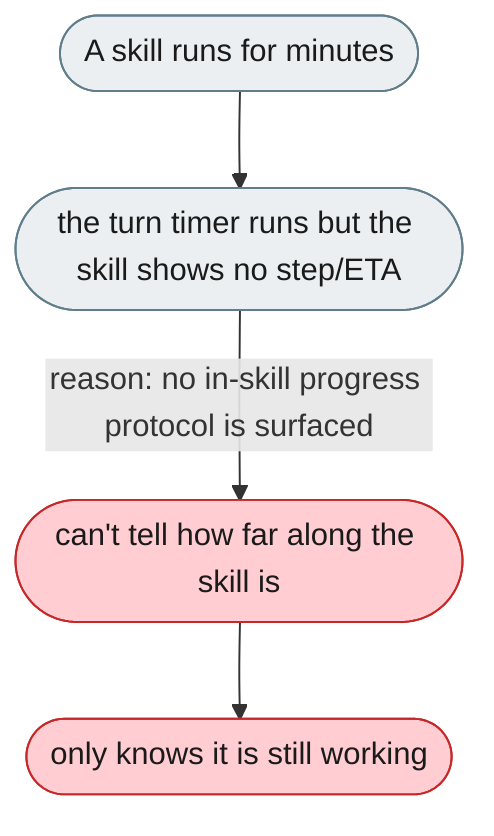
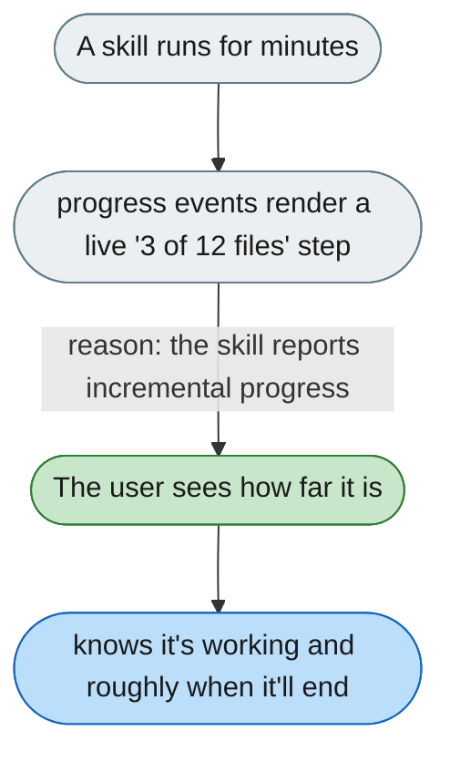

---

# No step-wise progress or ETA while a skill runs

*Concern: Output & Perceived Speed*

---

## The problem today

While a turn is active the UI does show that the agent is working (a per-turn running spinner plus live elapsed timer, and any activity the skill emits). But a long-running skill itself exposes no **step/fractional progress or ETA**: the tool card marks `success`/`failed` only after the call finishes, and there is no generic in-skill progress protocol (staged progress exists only for specific flows such as skill *generation* and harness extensions). So the user can't tell how far along a skill is or roughly when it will finish.

The user is not in the dark about *whether* it is working (spinner + elapsed are shown); the gap is *how far* it has gone and *when* it will finish.

---

## The proposed fix

Skills should emit lightweight progress events that render as a live step/progress indicator in the tool card — "parse-invoice: processed 3 of 12 files…" — with an ETA where feasible. The existing stage model (`HarnessProgressBar`) can be reused for this.

