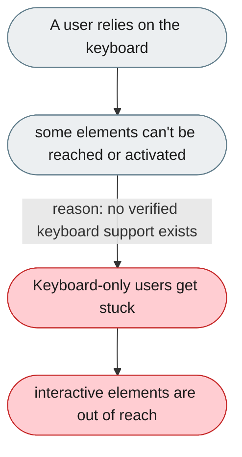
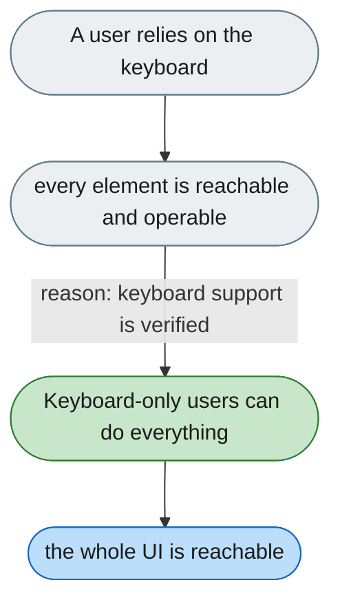

---

# The UI can't be driven fully by keyboard

*Concern: Accessibility & Keyboard*

---

## The problem today

Tab focus, arrow-key list navigation, and keyboard activation aren't verified. `shadcn/ui` + `lucide-react` support a11y, but it needs discipline in consuming components.

---

## The proposed fix

Every interactive element — session items, skill cards, toggles, tool-call buttons — reachable and operable by keyboard, with visible focus and arrow-key navigation in `ConversationSidebar`.

