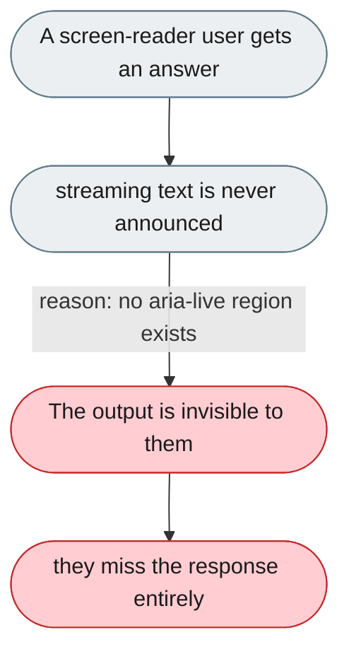
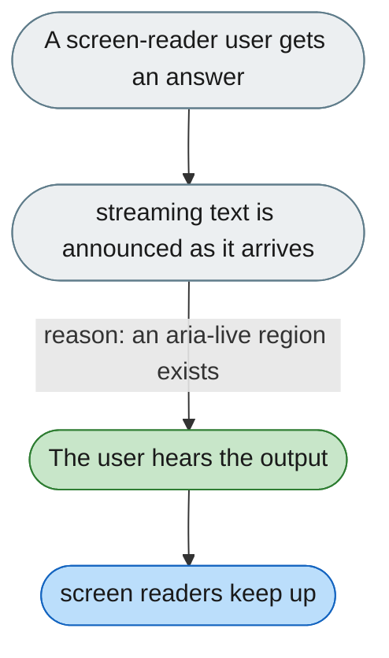

---

# No screen-reader support; streaming output isn't announced

*Concern: Accessibility & Keyboard*

---

## The problem today

No `aria-label`, `aria-live`, or `role` attributes are visible; streaming text has no `aria-live` region, so screen readers don't announce new content.

---

## The proposed fix

Make the streaming area `aria-live="polite"`, announce tool success/failure via `aria-live="assertive"`, add `aria-label` to icon-only buttons, and run an axe-core/Lighthouse audit.

