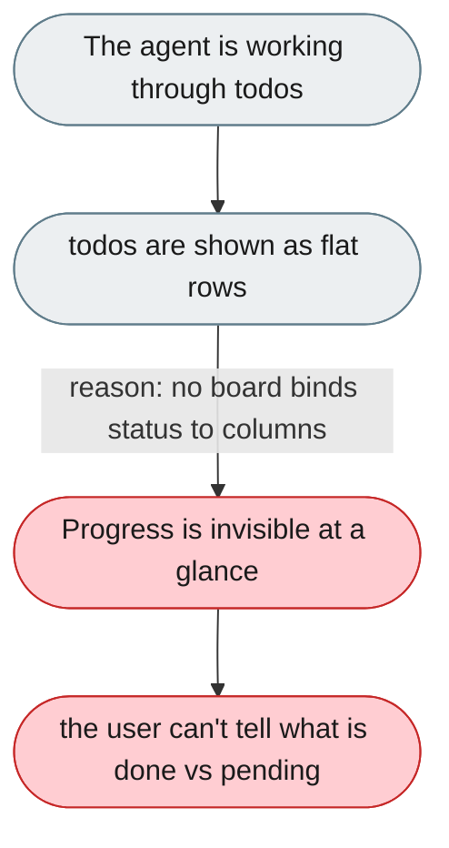
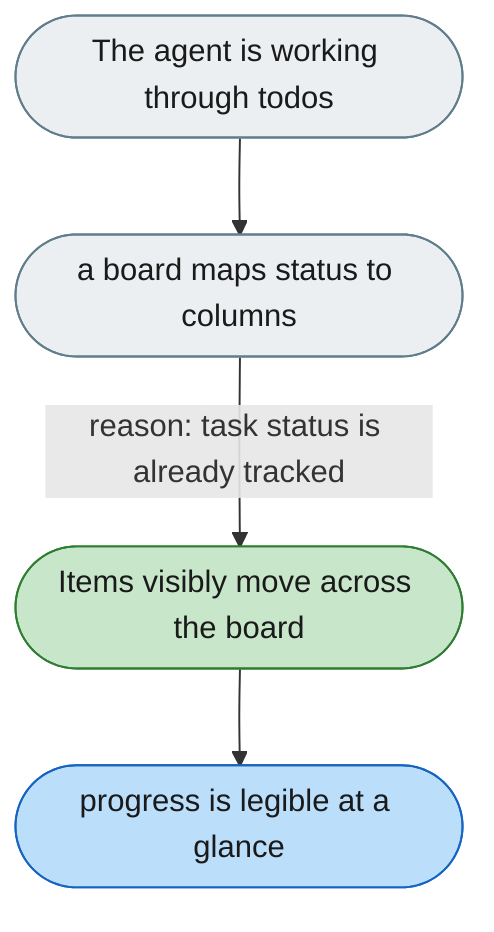

---

# The task list doesn't show progress moving

*Concern: Control & Continuity*

---

## The problem today

Goals and todos are rendered as flat rows, so there is no board on which a user can watch items move todo → in-progress → done as the agent works.

---

## The proposed fix

Add a task-board view driven by the existing `TaskPlan`/todo statuses (`PENDING`, `IN_PROGRESS`, `COMPLETED`, `CANCELLED`), with columns that update live as the agent changes status.

