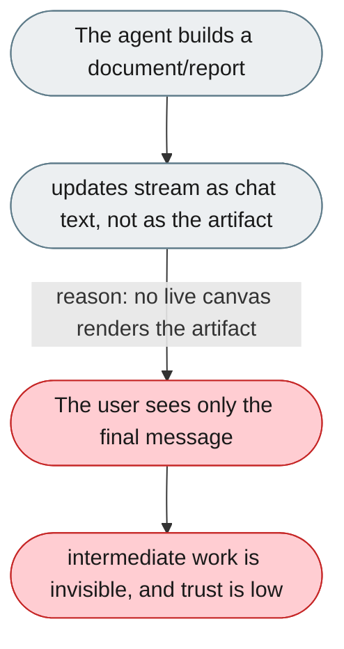
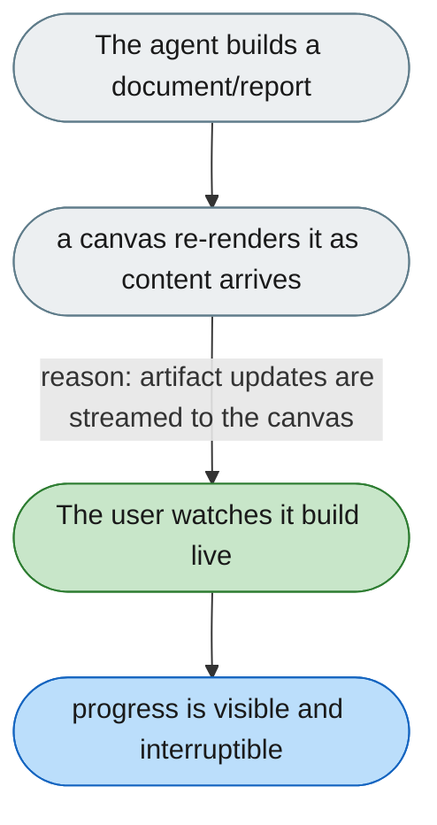

---

# The agent's output only lands as one final message

*Concern: Conversation*

---

## The problem today

There is no live canvas on which a document, diagram or report re-renders in place as the agent works; the artifact appears only when the agent finishes.

---

## The proposed fix

Add a live canvas panel that renders the current artifact (document/diagram/report) and re-renders it as new artifact content streams in, so the user watches it take shape rather than waiting for the final message.

