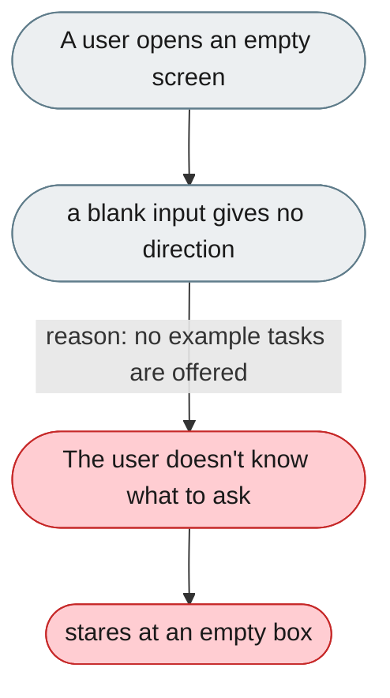
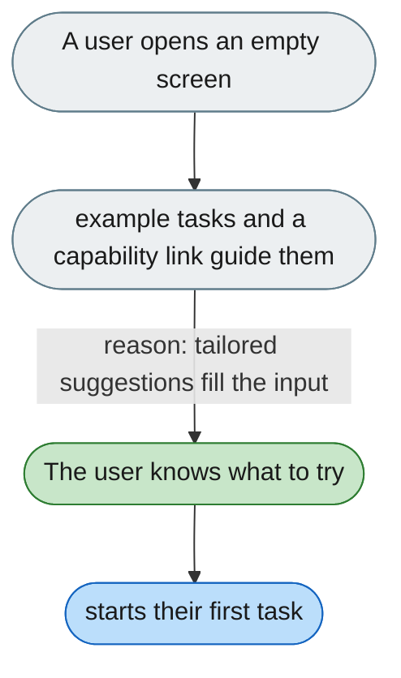

---

# Empty screen offers no example or next step

*Concern: Empty States & Choosing a Mode*

---

## The problem today

An empty conversation shows a blank input. `WelcomeBubble` exists but its content isn't discoverable without reading code.

---

## The proposed fix

Show 3–5 example tasks tailored to the active mode, a prompt chip that fills the input on click, and a "What can I do?" capability overview.

