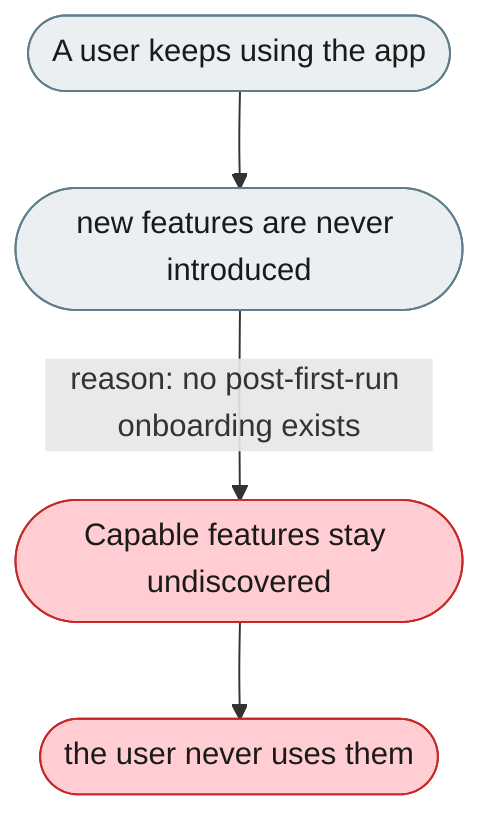
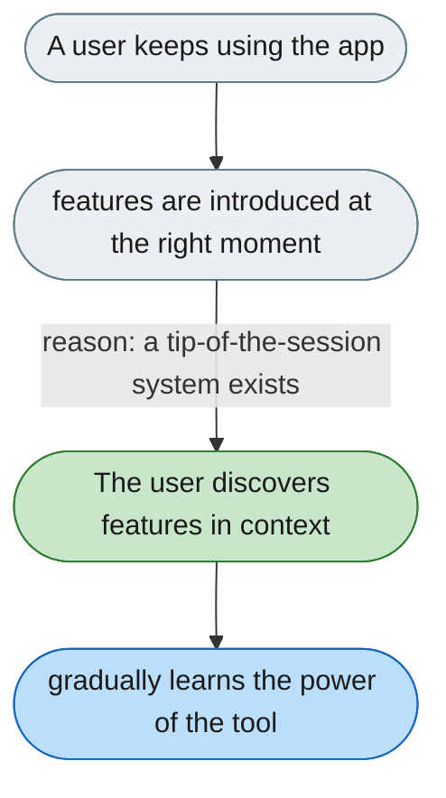

---

# No guidance introduces features after first run

*Concern: Progressive Discovery*

---

## The problem today

After the setup wizard there's no further onboarding — trajectory, skills, team mode, memory, and the connector market are never introduced unless the user stumbles on them.

---

## The proposed fix

A "tip of the session" system: once per new feature area, show a small non-blocking tooltip at the right moment (first multi-step task → "open the Trajectory panel"; first file write → "review changes"; after 5 sessions → "memory").

