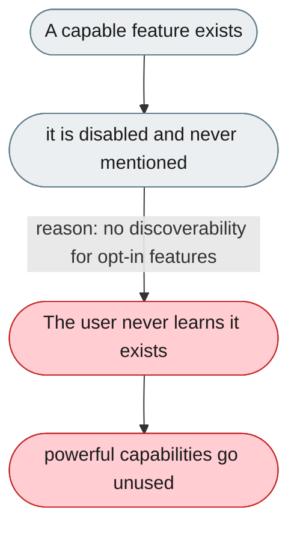
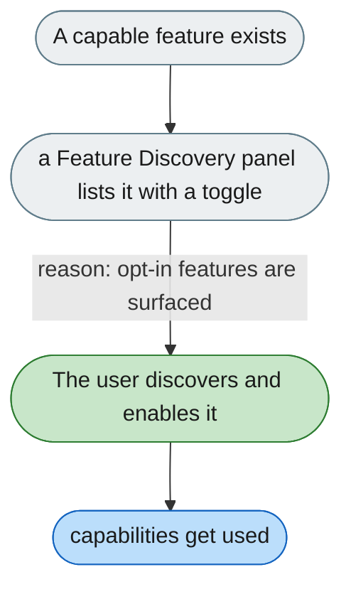

---

# Powerful features exist but are never surfaced

*Concern: Running & Managing the Instance*

---

## The problem today

Trajectory UI, OTel tracing, debug traces, coding memory, and the SSH channel exist but are off by default with no hint anywhere in the UI or startup output.

---

## The proposed fix

A "Feature Discovery" section in Web UI settings listing opt-in features with a description and toggle, plus startup tips like "trajectory UI is available — enable `trajectory_ui.enabled`".

