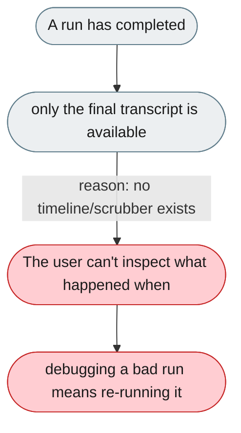
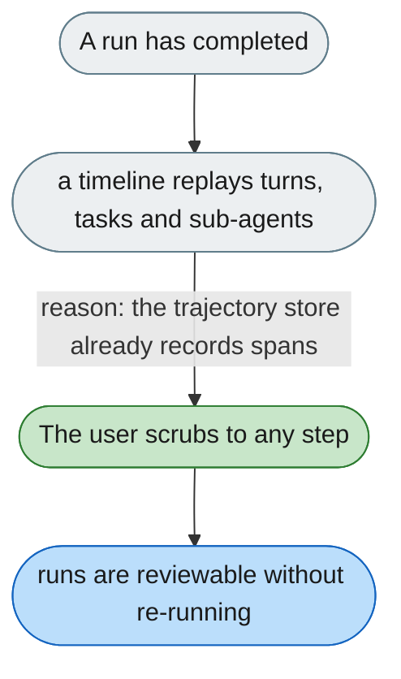

---

# Can't scrub back through what the agent did, turn by turn

*Concern: Explanation & Visibility*

---

## The problem today

There is no timeline to replay turns and tasks, expand sub-agent trees, and see per-turn tokens and diff snapshots — so a finished run cannot be reviewed step by step.

---

## The proposed fix

Build a replay timeline on the trajectory store: scrub through turns and tasks, expand sub-agent trees nested under their parent turn, and show per-turn tokens and artifact diff snapshots at each step.

