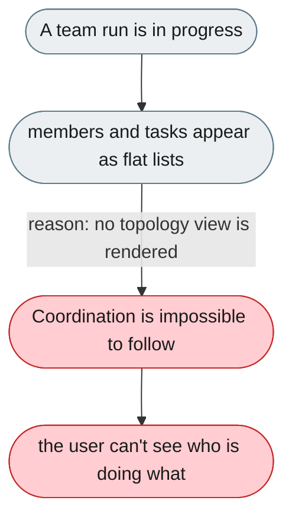
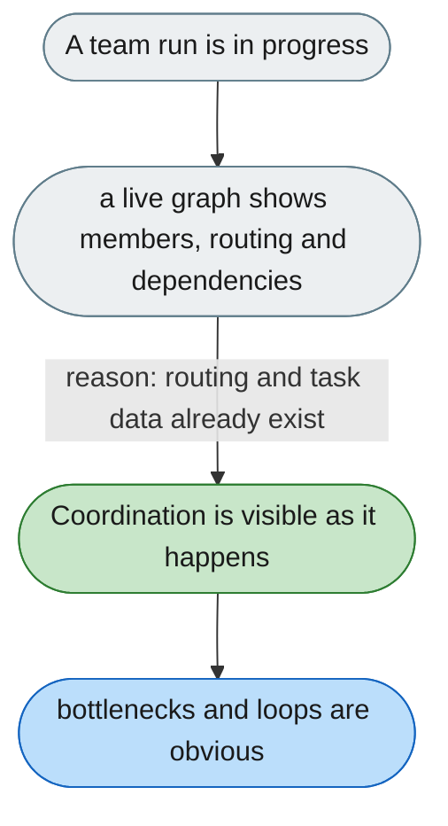

---

# No live picture of how the swarm is coordinating

*Concern: Explanation & Visibility*

---

## The problem today

Team state is shown as flat lists. There is no graph showing the leader, members, message routing and task dependencies in real time.

---

## The proposed fix

Render a live topology graph from the existing team runtime signals — leader and members as nodes, message routing as edges — overlaid with task-dependency links and current per-member status.

