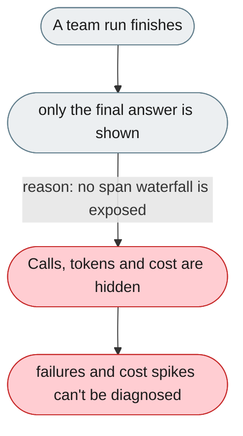
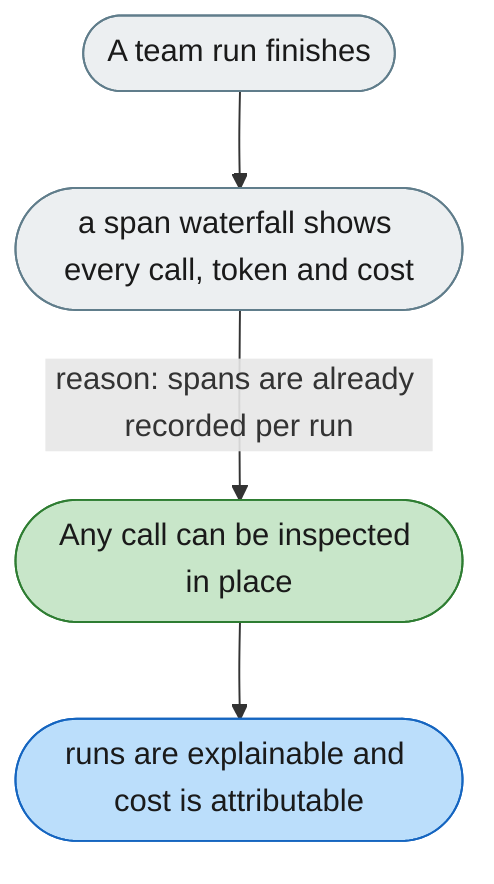

---

# No way to see every LLM/tool call and token behind a run

*Concern: Explanation & Visibility*

---

## The problem today

A team run shows only the final answer. There is no interactive span waterfall to inspect prompts, tool calls, tokens, cost, message routing and member lifecycle.

---

## The proposed fix

Expose the existing span tree as an interactive waterfall: each LLM and tool call as a span with prompt, result, tokens, cost and timing; message routing and member lifecycle shown inline. The trajectory store already records this data.

