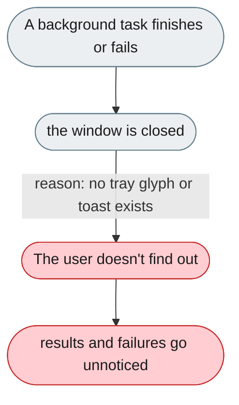
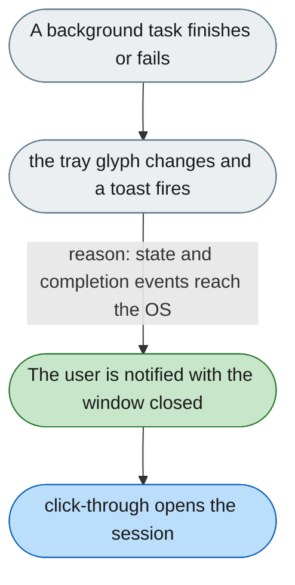

---

# No way to know the agent's state without opening the window

*Concern: History & Notifications*

---

## The problem today

The desktop app has no tray state glyph and no native toast when a background task finishes or fails while the window is closed.

---

## The proposed fix

Add a tray state glyph (idle / working / needs-attention) and native OS notifications on task completion or failure, deep-linking into the relevant session when clicked.

