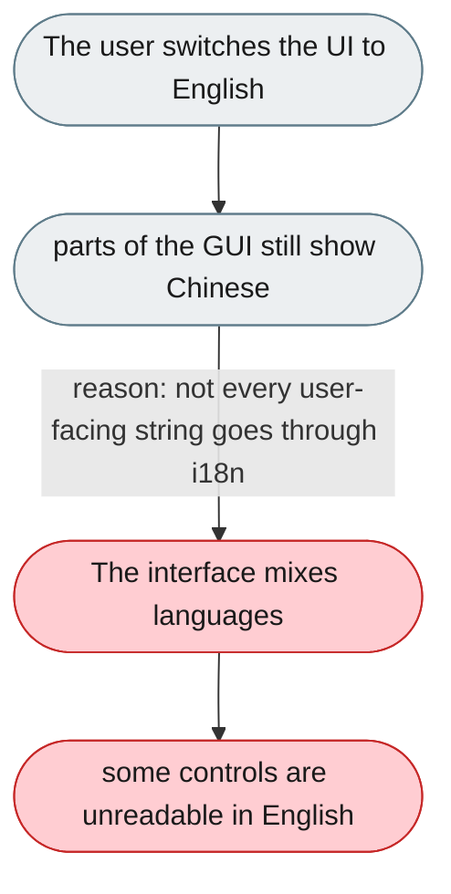
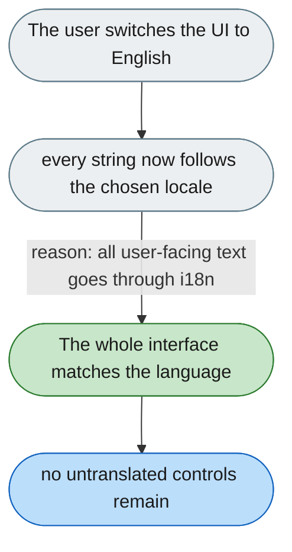

---

# GUI text is not fully translated

*Concern: Running & Managing the Instance*

---

## The problem today

Even when the UI language is set to English, parts of the interface still appear in Chinese. Several user-facing components contain hardcoded Simplified-Chinese literals instead of reading the locale files, so translation coverage is incomplete rather than a single surface being ignored.

---

## The proposed fix

Make i18n coverage complete: route every user-facing string through the locale files (en/zh), so choosing English (or Chinese) applies consistently across the whole interface with no hardcoded literals left.

